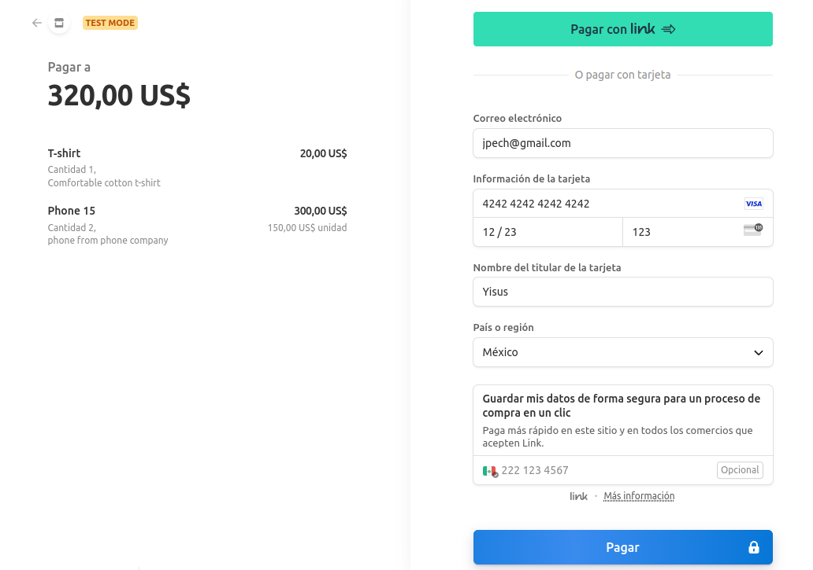

# StripePay

Este proyecto en Node.js es una práctica que se centra en la implementación de pagos seguros utilizando Stripe y el envío de confirmaciones por correo electrónico con Nodemailer. Ideal para desarrolladores que deseen aprender cómo gestionar transacciones en línea y enviar confirmaciones automatizadas.

# Instalación

Para ejecutar este proyecto en tu máquina local, sigue estos pasos:

## 1. Clona este repositorio en tu máquina local.

```bash
git clone https://github.com/yisusAbet24/StripePay.git
```

## 2. Instala las dependencias

```bash
npm install
```

## 3. **Iniciar la Aplicación:**

Para poner en marcha la aplicación, utiliza el siguiente comando:

```bash
npm run dev
```

# Uso

## Realizar un Pago

Realiza una solicitud POST a http://localhost:${PORT}/payment. Esto te proporcionará una URL para continuar con el proceso de pago.

Accede a la URL proporcionada, donde verás la lista de productos y la interfaz de pago de Stripe.



Puede utilizar las tarjetas de prueba proporcionadas por Stripe para llevar a cabo pruebas en el entorno de desarrollo. Estas tarjetas están diseñadas específicamente para facilitar la evaluación y el ajuste de la integración con Stripe. Para obtener más información sobre estas tarjetas de prueba y cómo utilizarlas de manera efectiva, puede consultar la documentación oficial de Stripe en el siguiente enlace: https://stripe.com/docs/testing

## Confirmación de Pago

Después de realizar el pago, se manejarán dos escenarios:

### - Si completas el pago exitosamente, serás redirigido a http://localhost:${PORT}/success.

```json
{
  "status": true,
  "message": "Email sent successfully from payments"
}
```


### - Si cancelas el pago, serás redirigido a http://localhost:${PORT}/cancel.

```json
{
  "message": "Your payment has been canceled."
}
```

Este es un ejemplo básico de cómo utilizar StripePay para gestionar pagos con Stripe y recibir confirmaciones. Puedes personalizar y ampliar esta aplicación según tus necesidades

#### Asegúrate de reemplazar `${PORT}` con el número de puerto en el que se está ejecutando tu aplicación en tu archivo. ¡Espero que esta guía de uso te sea útil!
